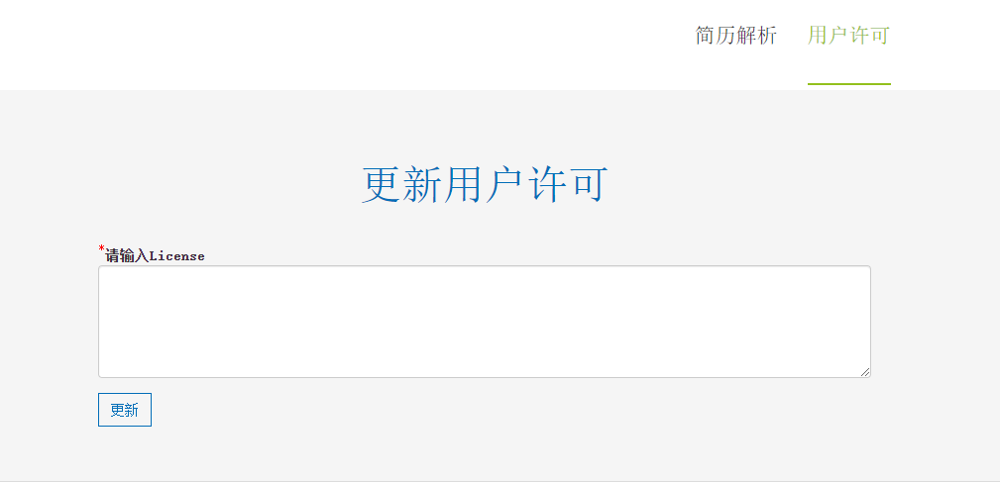

## 小芭智能简历解析系统

### 运行环境
- 硬盘：100G+
- 内存：16G+
- 操作系统：Ubuntu Server 16.04、18.04 或 20.04，centos 7.6, centos 7.9 推荐 Ubuntu Server 20.04
- Miniconda3 Python3.8 *
- JDK-8(oracle jdk-1.8) *
- LibreOffice 7.2.7 *
- HanLP 1.8 *
- MongoDB
- Docker 20.10
- Docker-compose 2.10+

**说明**：* 无需下载，安装包中已经包含这些组件。


### 服务器配置要求
- 推荐配置**4核16G内存**以上的服务器配置。


---
### Docker 安装 （推荐：需要安装docker和docker-compose）
1. 安装（linux环境）。

```bash
$ mkdir cvparser
$ cd cvparser
$ wget https://raw.githubusercontent.com/changwu/cvparser/main/docker-compose.yml  # 获取docker-compose.yml文件。
# 可参考docker-compose.yml中注释修改参数, 启动之前确保挂载目录 volumes.source 所指向的路径存在。
# volumes.source 路径如果不存在，使用 mkdir -p 创建目录
$ sudo mkdir -p /home/mongodb/data/{db,log}
$ sudo mkdir -p data logs
# 启动值守服务
$ docker-compose up -d # 插件方式安装的执行命令： docker compose up -d
```
2. 更新


 ```bash
 $ cd cvparser
 $ docker-compose down # 插件方式安装的执行命令： docker compose down
 $ docker-compose pull # 插件方式安装的执行命令： docker compose pull
 $ docker-compose up -d # 插件方式安装的执行命令： docker compose up -d
 ```

**提示：** Windows下请先安装Docker Desktop，参考上述linux命令进行安装。


---
### 手动安装
#### 下载
    前往 [Release](https://github.com/changwu/cvparser/releases) 中下载安装包：cvparser-x.x.x.tar.gz

#### 安装

解压后执行 scripts/install.sh 安装， 如：  

```bash
$ tar -zxvf cvparser-2.1.1.tar.gz
$ cd cvparser-2.1.1
$ ./scripts/install.sh
```

最后如果出现了“dependence tools install finished ......”，但未看到 “智能简历解析工具安装成功” 的提示，说明conda 环境可能未正确初始化，请手动初化 conda 环境后再执行 `scripts/install.h` :

```bash
$ source ~/.bashrc
$ ./scripts/install.sh
```
#### 启动服务

```bash
$ cd cvparser-2.1.1
$ ./scripts/start.sh
```

因服务启动时要加载 NLP 相关模块, 请耐心等待一会  
**特别提示:** 可以启动多个不同端口的服务，然后通过nginx针对多个服务端口来做负载均衡。  

---
### 获取License
1. 获取试用版本License  
    启动 cvparser 服务之后，浏览器访问**用户许可页面**（[http://127.0.0.1:5000/license](http://127.0.0.1:5000/license)）, 点击**申请免费试用许可**按钮申请试用版本 License。
    如果是云服务器，则将 127.0.0.1:5000 换成你的云服务器公网IP和端口。
    

2. 获取正式版本License  
    - 在上面的**用户许可页面**中，复制**机器码**，然后[联系我们](https://www.ibaguo.com/contact/)获取License。
    - 点击**用户许可页面**中的**更新用户许可**按钮，在更新用户许可页面中输入获取到的正式版 License，然后点击**更新**按钮。
    


---
### 配置文件
可以通过修改配置文件：cvparser/config/config.json进行一些自定义的用户配置，如 API_TOKEN 等。
```json
{
    "admin_enable": false,
    "mongodb": {
        "host": "localhost",
        "port": 27017,
        "dbname": "cvparser",
        "username": null,
        "password": null
    },
    "api_token": null,
    "secret_key": "flasksecret+key<!@^_",
    "log_dir": "logs",
    "upload_dir": "data/uploads",
    "resume_dir": "data/resumes"
}
```
|   字段名       |    字段说明   |
|----------------|--------------|
|  admin_enable | 是否启用 admin 功能，true: 开启，false: 不开启，默认为 false。需要 mongodb 数据库服务|
|  mongodb.host  | mongodb 服务 host，在本机可用 localhost 或 127.0.0.1 |
|  mongodb.port  | mongodb 服务端口 |
|  mongodb.dbname  | mongodb cvparser db 名称，无需修改 |
|  mongodb.username  | mongodb 用户名，默认无， 设置为 null |
|  mongodb.password  | mongodb 密码，默认无，设置为 null|
|  api_token  |  API Token，用于 API 请求校验， 设置为 null 则不校验 |
|  secret_key |  Web APP Secret Key  |


### Admin 功能
启用了 Admin 功能后，可通过 http://127.0.0.1:5000/admin 访问Admin页面。 Admin 默认用户名： admin，密码： 999999  


登录之后，可点击右上角头像处修改密码。  


**Docker 方式启动默认开启Admin功能。**


---
### 常见安装问题
1. The package lists or status file could not be parsed or opened
   ```
   Reading package lists... Error!
   E: Encountered a section with no Package: header
   E: Problem with MergeList /var/lib/apt/lists/repo.**************_Packages
   E: The package lists or status file could not be parsed or opened.
   ```
   >解决办法:  
   ```
   $ sudo apt-get clean
   $ sudo apt-get update
   ```
2. ERROR: File or directory already exists: '/opt/miniconda3'
   >解决办法:  
   >  1) /opt/miniconda3 目录已经存在，说明你可能已经安装过了 miniconda, 请正确配置好 conda 环境然后重新运行安装脚本
   >  2) 如果没有安装miniconda,那么请确认/opt/miniconda3 目录是否可以改名或删除
   >  3) 如果没有安装miniconda, 且 /opt/miniconda3 目录有其他用处，则需要修改 miniconda3 的默认安装路径：
   >      ```
   >      export CONDA_INSTALL_PREFIX=/opt/miniconda3_resume
   >      ./scripts/install.sh
   >      ```

3. data/dictionary/***.txt:  mismatching "local" filename (data/dictionary/custom/人名词典.txt) 等
   >解决办法:  
   >  `locale` 命令查看当前系统的 LANG 和 LC_* 环境变量，确保 LANG 和 LC_* 等环境变量的值是 C.UTF-8 或 zh_CN.UTF-8 或 en_US.UTF-8  
   >  如果是 POSIX， 请按如下方法修改:  
   >  ```
   >  export LANG=C.UTF-8
   >  export LC_ALL=C.UTF-8
   >  locale
   >  ```
   >  修改之后重新执行安装脚本  
   >  ```
   >  ./scripts/install.sh
   >  ```

4. 安装 requirements 报 timeout 错误
   ```
   socket.timeout: The read operation timed out

   pip._vendor.urllib3.exceptions.ReadTimeoutError: HTTPSConnectionPool(host='files.pythonhosted.org', port=443): Read timed out.
   ```
   > 解决办法：  
   > 为 pip install 添加代理，可用代理有：  
   >  - 中国科学技术大学：https://pypi.mirrors.ustc.edu.cn/simple/
   >  - 清华大学：https://pypi.tuna.tsinghua.edu.cn/simple/
   >  ```
   >  $ pip install -i https://pypi.tuna.tsinghua.edu.cn/simple/ -U -r requirements.txt
   >  ```
   >  如果中途还有报错的话，多试几次就好。

  5. OSError: libcrypto.so.1.1: cannot open shared object file: No such file or directory  
    问题原因： 系统的 OpenSSL 版本太低，不是 1.1.1 的版本。  
    解决办法：  
      - 方案1：升级 openssl 为 1.1.1 版本。  
      - 方案2：设置环境变量`LD_LIBRARY_PATH`。  
        ```
        export LD_LIBRARY_PATH=${CONDA_EXE%/bin/conda}/lib:$LD_LIBRARY_PATH
        ```
- **如有其他安装问题，请联系开发人员协助解决**


---
### API 列表:
|API               | Methods |       Desc     |
|----------------- |-------  |----------------|
|/api/resume_parser | POST   |    解析简历    |

**详细内容请查看[API文档](https://www.ibaguo.com/blog/post-2/)**

---
### API PYTHON 示例
```python
import os
import requests
import base64
import pprint

api_url_base = 'http://127.0.0.1:5000/api'
api_token = 'tk-1234567890'


def resume_parser(filename: str):
    api_url = '{}/resume_parser'.format(api_url_base)
    with open(filename, 'rb') as fp:
        data = fp.read()
    enc_data = base64.b64encode(data).decode()
    req = requests.Session()
    payload = {
        'file_name': os.path.basename(filename),
        'file_mode': 1,
        'file_cont': enc_data,
        'token': api_token
    }
    res = req.post(api_url, json=payload)
    if res.ok:
        return res.json()
    return (res.status_code, res.reason)


if __name__ == '__main__':
    result = resume_parser('test-resume.txt')
    pprint.pprint(result)

```

### API JAVA 示例
```java
import java.io.File;
import org.apache.commons.io.FileUtils;
import org.apache.commons.codec.binary.Base64;
import org.apache.http.Consts;
import org.apache.http.HttpResponse;
import org.apache.http.client.HttpClient;
import org.apache.http.client.methods.HttpPost;
import org.apache.http.entity.StringEntity;
import org.apache.http.impl.client.DefaultHttpClient;
import org.apache.http.util.EntityUtils;
import org.json.JSONObject;

public class TestParseApi {

    public static void testResumeParser(String url, String fname, String token) throws Exception {
    	// 设置头字段
        HttpPost httpPost = new HttpPost(url);
        httpPost.addHeader("content-type", "application/json");
        
        // 读取简历内容
    	byte[] bytes = FileUtils.readFileToByteArray(new File(fname));
    	String data = new String(Base64.encodeBase64(bytes), Consts.UTF_8);
    	
        // 设置内容信息
        JSONObject json = new JSONObject();
        json.put("token", token);			// token
        json.put("file_mode", 1);			// 解析模式
        json.put("file_name", fname);	// 文件名
        json.put("file_cont", data);	// 经base64编码过的文件内容
        StringEntity params = new StringEntity(json.toString(), Consts.UTF_8);
        httpPost.setEntity(params);
        
        // 发送请求
        HttpClient httpclient = new DefaultHttpClient(); 
        HttpResponse response = httpclient.execute(httpPost);
        
        // 处理返回结果
        String resCont = EntityUtils.toString(response.getEntity(), Consts.UTF_8);
        System.out.println(resCont);
        
        JSONObject res = new JSONObject(resCont); 
        JSONObject status = res.getJSONObject("status");
        if(status.getInt("code") != 200) {
        	System.out.println("request failed: code=<" + status.getInt("code") + ">, message=<" + status.getString("message") + ">");
        }
        else {
        	JSONObject result = res.getJSONObject("result");
        	System.out.println("result:\n" + result.toString(4));
        	System.out.println("request succeeded");
        }
    }
    
    public static void main(String[] args) throws Exception {
        String url = "http://127.0.0.1:5000/api/resume_parser";	
        String fname = "./test-resume.txt";	// 替换为你的简历文件名，确保后缀名正确
        String token = "tk-1234567890";		// YOUR TOKEN

        testResumeParser(url, fname, token);
    }
}
```

### 购买须知

小芭智能简历解析系统根据服务目标不同分为三种版本：免费试用版、基础版和专业版。  
价格和服务内容可以访问网页进行了解：<https://www.ibaguo.com/pricing/>


### 联系我们

*   电话： +86 137 2088 1902
*   邮箱： <xiaoba@ibaguo.com>
*   微信：wuxiaoba8085  


